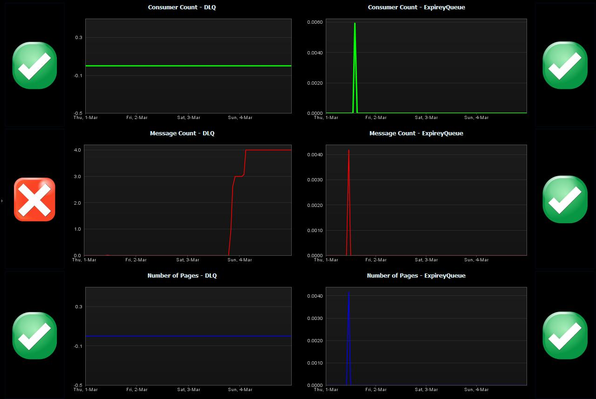

# HornetQ FastPack

## Overview

The HornetQ FastPack provides **sensors** in a template **system profile** and a **dashboard** for the HornetQ messaging system.  
Please also see the article on [How To Manage HornetQ based Applications](https://community/display/LEARN/How+To+Manage+HornetQ+based+Applications).

## FastPack Details

|Name | HornetQ FastPack
|:--- | :---
| Author | Derek Abing
| Supported dynaTrace Version | >= 5.5 
| License | [dynaTrace BSD](dynaTraceBSD.txt)
| Support | [Not Supported](https://community.compuwareapm.com/community/display/DL/Support+Levels#SupportLevels-Community+Supported)
| Release History | Version 1.0
| Downloads | [FastPack Package (System Profile with sensors and Dashboards)](HornetQ_FastPack.dtp)

## HornetQ Dashboard

This dashboard provides helps identifying performance problems in the overall message processing infrastructure of HornetQ.

  * **Consumer Count**: indicates how many consumers are currently running. 

  * **Message Count**: indicates that messages aren't being processed in a timely manner. 

  * **Number of Pages**: indicates that the queues memory quota is filled. 

The dashboard is collecting the data for these measures on the DLQ and ExpiryQueue Queues. These queues are generally used as buckets to hold messages that have expired or cannot be delivered.

## Installation

  1. Import the [FastPack](HornetQ_FastPack.dtp) into your dynaTrace Server using your dynaTrace client. 

  2. As this FastPack doesn't contain a plugin, it will NOT show up in the plugins overview of your dynaTrace Server. After a dialog box informing you about the successful installation, you will see a new system profile as well as a new dashboard, both called "HornetQ". 

